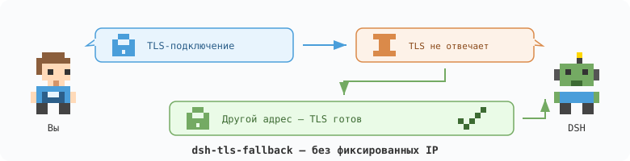

<h1 align="center">DSH TLS Fallback</h1>

<p align="center"></p>

<p align="center">Резервное TLS-подключение для выбранных провайдеров DeepSeek Harness — без закрепления IP.</p>

<p align="center"><a href="./README.md">English</a> · <a href="./README.ru-RU.md">Русский</a> · <a href="./README.zh-CN.md">简体中文</a></p>

<p align="center"><a href="./LICENSE"></a> <a href="https://nodejs.org/">=22.19" src="https://img.shields.io/badge/Node.js-%3E%3D22.19-339933?style=flat-square"></a></p>

## Возможности

DNS-адрес может принимать TCP-соединение, но зависать на TLS-рукопожатии. Плагин пробует другие актуальные DNS-адреса, не закрепляя IP и не отправляя запрос к модели повторно.

- Выбор LLM-провайдеров в штатных настройках DSH.
- Изоляция провайдеров, даже если у них один endpoint.
- Свежий DNS для каждого нового соединения; запуск TLS-попыток с небольшой задержкой.
- Сохранение исходного hostname, SNI и проверки сертификатов.
- Проксируемые и невыбранные запросы остаются на прежнем транспорте.

Целевая версия — **DSH 0.2.0-rc.2**, Node.js **22.19+**.

## Архитектура

```text
┌────────────┐    ┌───────────────────┐
│ LLM stream │───▶│ Provider + policy │
└────────────┘    └─────────┬─────────┘
                           ├── bypass ──▶ Previous dispatcher
                           └── direct ──▶ DNS ──▶ TLS race ──▶ HTTP
```

В гонку TLS попадают только прямые HTTPS-запросы выбранного провайдера в рамках LLM-вызова через глобальный диспетчер Node fetch/undici. HTTP отправляется по победившему соединению.

## Установка

1. Скачайте `dsh-tls-fallback-0.1.0.tgz` из [Releases](https://github.com/SerzhSharapa/dsh-tls-fallback/releases).
2. В DSH откройте **Плагины → Добавить плагин**, укажите абсолютный локальный путь к архиву и установите его.
3. Если DSH попросит, перезапустите приложение; затем обновите интерфейс.

Используйте пакет `.tgz`, а не архив GitHub «Source code». Публикация в npm для установки не нужна.

## Быстрый старт

1. Откройте **Настройки → Резервное TLS-подключение**.
2. Оставьте переключатель включённым и отметьте провайдера с тайм-аутами подключения.
3. Отправьте обычное сообщение через этого провайдера.

Изменения сохраняются автоматически. По умолчанию провайдеры не выбраны: свежая установка не меняет маршрутизацию запросов. Снимите отметку или выключите переключатель, чтобы последующие запросы обходили плагин.


*Реальный интерфейс DSH на русском языке с выбранным GLM. Скриншот обрезан; имя пользовательского провайдера скрыто.*

## Область действия и ограничения

- По умолчанию: 250 мс между попытками, общий предел DNS/TLS — 10 секунд, до 8 адресов.
- Нет фиксированных IP, изменений сети ОС, изменений учётных данных и HTTP-повторов.
- Плагин не обрабатывает HTTP, адреса с IP вместо hostname, проксируемые запросы, вызовы вне выбранного LLM-контекста и WebSocket-транспорт.
- Адаптеры с собственным диспетчером или транспортом не на Node могут обходить плагин.
- Он не исправляет неверные ключи, лимиты запросов, HTTP-ошибки сервера и медленную генерацию.
- Отмена запроса возвращает управление быстро; незавершённые попытки подключения могут жить до своего deadline или выгрузки плагина.
- Не запускайте одновременно старый независимый TLS-фикс: он может продолжать влиять на провайдеров, не выбранных здесь.

## Разработка

```bash
git clone https://github.com/SerzhSharapa/dsh-tls-fallback.git
cd dsh-tls-fallback
npm ci --ignore-scripts
npm test
npm pack
```

`npm pack` собирает клиентскую часть. Тесты проверяют изоляцию провайдеров и реальные локальные TLS-соединения; интеграционным тестам нужен OpenSSL. Полученный архив устанавливается штатным менеджером плагинов DSH.

## Лицензия

[MIT](./LICENSE).
