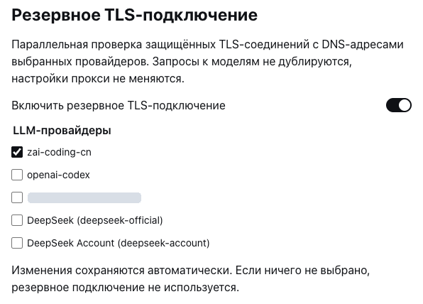

<h1 align="center">DSH TLS Fallback</h1>

<p align="center"></p>

<p align="center">为 DeepSeek Harness 中选定的提供商提供 TLS 连接回退，无需固定 IP。</p>

<p align="center"><a href="./README.md">English</a> · <a href="./README.ru-RU.md">Русский</a> · <a href="./README.zh-CN.md">简体中文</a></p>

<p align="center"><a href="./LICENSE"></a> <a href="https://nodejs.org/">=22.19" src="https://img.shields.io/badge/Node.js-%3E%3D22.19-339933?style=flat-square"></a></p>

## 功能亮点

某个 DNS 地址可能接受 TCP 连接，却在 TLS 握手阶段停滞。本插件尝试其他当前 DNS 地址，不固定 IP，也不重复发送模型请求。

- 在 DSH 原生设置中选择 LLM 提供商。
- 即使共用同一端点，提供商之间仍保持隔离。
- 每次新建连接都重新查询 DNS，并错开启动 TLS 尝试。
- 保留原始主机名、SNI 和证书验证。
- 代理请求及未选中提供商的请求继续使用原有传输。

目标版本为 **DSH 0.2.0-rc.2**，需要 Node.js **22.19+**。

## 架构

```text
┌────────────┐    ┌───────────────────┐
│ LLM stream │───▶│ Provider + policy │
└────────────┘    └─────────┬─────────┘
                           ├── bypass ──▶ Previous dispatcher
                           └── direct ──▶ DNS ──▶ TLS race ──▶ HTTP
```

只有选定提供商在 LLM 调用范围内、经全局 Node fetch/undici 调度器发出的直连 HTTPS 请求才会进入 TLS 竞争。HTTP 请求通过胜出的连接发送。

## 快速安装

1. 从 [Releases](https://github.com/SerzhSharapa/dsh-tls-fallback/releases) 下载 `dsh-tls-fallback-0.1.0.tgz`。
2. 在 DSH 中打开 **Plugins → Add plugin**，输入下载文件的本地绝对路径并安装。
3. 如果 DSH 提示重启，请重启应用，然后刷新界面。

请使用 `.tgz` 安装包，而不是 GitHub 的 “Source code” 压缩包。安装不依赖 npm 仓库发布。

## 快速开始

1. 打开 **设置 → TLS 连接回退**。
2. 保持开关启用，并勾选出现连接超时的提供商。
3. 通过该提供商发送一条普通消息。

更改会自动保存。默认不选择任何提供商，因此新安装不会改变请求路由。取消勾选或关闭开关后，后续请求将绕过本插件。



*真实的 DSH 俄语设置界面，已选择 GLM。截图已裁剪，并遮盖了自定义提供商名称。*

## 适用范围与限制

- 默认设置：尝试间隔 250 毫秒，DNS/TLS 总时限 10 秒，最多 8 个地址。
- 不固定 IP，不修改操作系统网络或凭据，也不重试 HTTP 请求。
- 不处理 HTTP、IP 字面量主机、代理请求、选定 LLM 调用范围之外的请求或 WebSocket 传输。
- 使用独立调度器或非 Node 传输的适配器可能绕过本插件。
- 无法修复无效凭据、请求限流、HTTP 服务端错误或缓慢的模型生成。
- 取消请求会及时返回；尚未结束的连接尝试可能持续到连接时限或插件卸载。
- 请勿同时运行旧的独立 TLS 修复插件：它可能仍影响此处未选中的提供商。

## 开发

```bash
git clone https://github.com/SerzhSharapa/dsh-tls-fallback.git
cd dsh-tls-fallback
npm ci --ignore-scripts
npm test
npm pack
```

`npm pack` 会构建客户端。测试涵盖提供商隔离及真实的本地 TLS 连接；集成测试需要 OpenSSL。通过 DSH 原生插件管理器安装生成的压缩包。

## 许可证

[MIT](./LICENSE).
